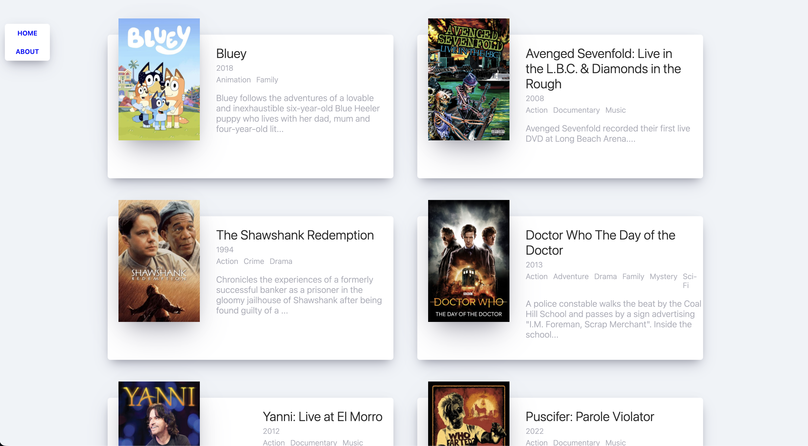

# Movie-App Clone Ver.2019
Study React Ver.2019
(Using class component to handle state)

## 🔗 Demo
https://jonghwa3471.github.io/study-react-movie-app-clone-2019/

## 🖥 Preview

## 🔥 Stack

### Front-end

 

## ✅ Packages

- [x] React
- [x] GitHub

## 📖 Theory

- [x] class component (for use state)
- [x] componentDidMount
- [x] axios

## 📱 View

- [x] Movie List
- [x] More Info
